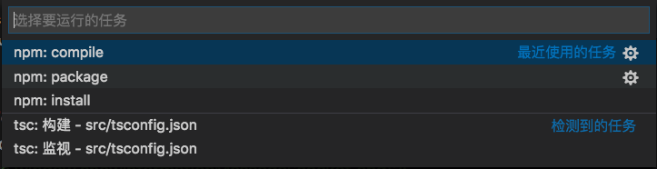
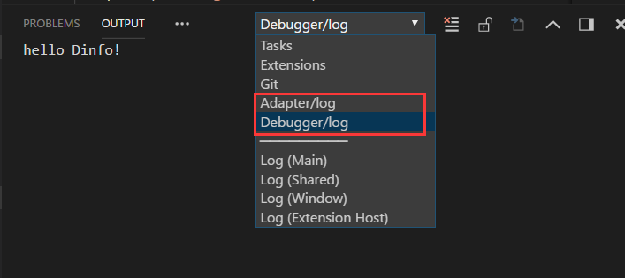

# 工程说明

[TOC]

## 项目框架


如图，主体上整个调试工具被分为三个模块。

- VSCode 提供的Debugger UI
- 调试扩展 Debug Extension。它的核心是 debug adapter(调试适配器，简称adapter)
- 整个调试工具的核心 Debugger (调试器)


## 代码规模

​	adapter 部分使用 typescript , 代码行数约1000行。

​	debugger 端使用 lua / C++ , 代码行数约 2300(lua) / 1000(C++) 行


## 目录结构

```
工程目录结构
.
├── Debugger
│   ├── debugger_lib         	
│   │	├── libpdebug.h/cpp     C调试库源码
│   │	└── plugins				打包好的调试库文件
│   └── LuaPanda.lua         	Debugger源码
├── Docs						项目文档
├── LICENSE.txt					证书
├── package.json				工程配置文件
├── README.md					VSCode插件帮助
├── src							VSCode Extension源码
│   ├── LogManager.ts			日志管理模块
│   ├── StatusBarManager.ts		状态栏管理模块
│   ├── dataProcessor.ts		adapter<->debugger之间数据收发
│   ├── debugAdapter.ts			Adapter入口文件
│   ├── extension.ts			VSCode插件启动文件
│   ├── luaDebug.ts				实现Adapter的主要功能
│   ├── luaDebugRuntime.ts		一些中间方法
│   ├── tsconfig.json			vscode工程生成文件
│   └── tslint.json				vscode工程生成文件
└── TodoList.md					规划更新
```


## 开发指南

Adapter 和 Debugger 之间使用了网络通信，以便远程调试。 协议选择使用了TCP。原因是TCP可以帮助我们处理丢包，乱序等情况。调试对传输实时性没有特别高的要求，TCP可以满足需要。需要注意的是，TCP是字节流形式发送，传输过程中可能出现粘包，包被截断的情况，我们使用了消息队列进行处理。

在我们的项目中adapter作为server端。debugger作为client，在没有连接上server，的情况下client会周期性的发起连接请求，以便随时连接。

**工作流程**

```sequence
Title:调试器基本交互逻辑
participant vscode
participant adapter
participant debugger
Note right of adapter: 等待链接
debugger->adapter:请求建立连接
Note right of adapter: 建立连接
adapter ->vscode: 准备初始化
vscode-> adapter : 初始化设置和断点信息
adapter->debugger: 初始化设置和断点信息

Note left of debugger : 保存断点
Note left of debugger : 设置钩子
Note left of debugger : 正常运行...

Note left of debugger : 命中断点
debugger->adapter:命中断点（文件路径，行号）
vscode-> adapter : 调用栈信息
adapter -> debugger: 请求变量信息，调用栈
debugger->adapter: 变量和调用栈
adapter->vscode: 展示断点行，变量信息

Note left of debugger:阻塞，等待命令
vscode-> adapter : 用户操作，continue
adapter -> debugger: continue
debugger->adapter: 收到命令，确认
adapter->vscode: debugger收到命令
Note right of debugger :继续执行...
```

( 若看不到流程图，请点击 [这里](../static/work-flow.png))

启动时，adapter把VSCode前端信息（包括初始化设置和断点）传给debugger，之后debugger会设置钩子，监控lua运行状态。lua每执行一行都会进入钩子函数中，钩子中会做断点判断，遇到断点处会暂停主线程lua的执行，并把变量信息和调用栈发给VSCode展示。


## 编译和运行方法

1. 下载工程后，在工程目录下运行 `npm install` 安装 npm 依赖，此操作要连外网或设置代理。
2. 编译: 把整个工程目录 `LuaPanda` 用 VSCode 打开， 点击菜单 terminal -> RunBuild Task， vscode会自动切换到console进行编译


*每次修改代码后要先编译再运行

3. 打包: 点击菜单 terminal -> Run Task. 选择package, 就会在工程目录下打出VSIX包



4. 切换到 VSCode 的 debug 页卡，点击 run 按钮。会弹出 [扩展开发主机] 窗口。这个窗口中已经安装了编译好的插件，在[扩展开发主机]窗口中进行调试操作即可。

*使用源码运行时如果扩展开发主机提示"扩展10秒内没有响应" 并无法调试，说明无法连接 VSCode 服务器，请切换网络重试。


## 调试日志查看方法

我们在调试器中建立了日志系统，方便追踪调试器运行状态。

**日志分级**：调试日志分为三级 `0:all所有信息; 1:info仅必要信息(默认); 2:error仅错误`。在被调试工程的launch.json中logLevel可以设置。

**查看日志**：在VSCode的OUTPUT(输出)页卡中，分别展示Adapter和Debugger的日志。




