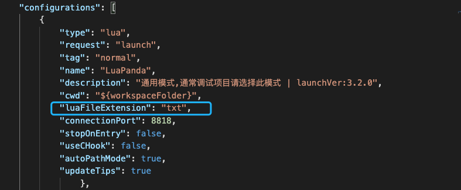
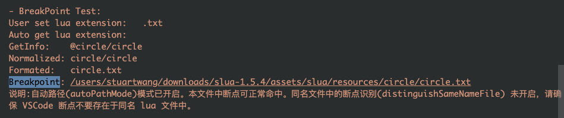
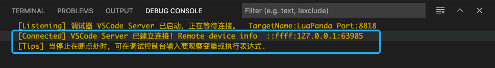

# FAQ

[TOC]


## 发布环境中请勿使用调试器

调试器本身对lua执行效率有一定影响，请在正式发布环境中清除调试器相关代码，包括

- `require("LuaPanda").start();`
- `LuaPanda.BP()`
- `LuaPanda.getInfo()`
- `LuaPanda.getCWD()`
- `LuaPanda.getBreaks()`


## 文件路径大小写敏感的设置

+ 如果在运行时获得的文件路径大小写和实际的文件不一致，可以设置`launch.json`中pathCaseSensitivity 项为false。

+ 大小写敏感设置是为了解决有些框架中传给lua虚拟机的路径被转换为了小写的，导致命中断点时路径无法匹配的问题。


## 查看调试日志

- 调试器自带日志模块，方便追踪问题。使用方法是切换到console的OUTPUT(输出)页卡, 选择 LuaPanda Adapter 或者 LuaPanda Debugger 就可以查看对应的日志。
- 通常看Adapter就可以展示Adapter和Debugger的交互信息。
- 如果需要更全面的日志，可以调整launch.json中的`logLevel:0`，再查看Debugger日志，可以输出每行执行到的文件信息。因日志较多，level设置为0可能会造成卡顿（0级日志主要用于调试器开发，使用时开1级日志就可以）。


## 可否调试协程

可以，在协程中可以下断点进行调试。要注意的是，协程中的调用栈仅显示携程内的调用信息。


## 调试器的路径处理规则

在调试控制台中输入`LuaPanda.getCWD()`或直接调用会返回三条路径

```
cwd:      工程中launch.json中cwd设置项的路径
getinfo:  从lua虚拟机中获取的当前执行的文件路径
format:   cwd + getinfo
```

- 如果getinfo获取了相对路径，那么会用cwd + 相对路径拼接成文件完整路径。如果getinfo获取了绝对路径，那么忽略cwd，直接使用这个绝对路径
- format路径是调试器认为的文件有效路径。用来做断点判断和通知vscode打开文件。如果vscode提示文件找不到，就是format路径错误了。
- getinfo难以调整。通常是调整cwd已获得正确的format路径。调整方法包含更改vscode打开的目录层级，也可以直接修改launch.json中cwd设置。


## 为什么调试时提示找不到文件

说明上一条**路径处理规则**中提到的format路径不正确。

解决办法：

不要停止调试，直接在调试控制台中输入`LuaPanda.getCWD()`。看一下format路径是否多了或者缺少层级。

+ 如果是路径错了，调整cwd，可以增加路径层级或是/../保证拼接后的路径正确。

+ 如果是format的文件后缀有误，按上面的说明修改后缀。


## 关于硬断点

- 调试器提供了硬断点，在用户代码里调用`LuaPanda.BP()`就可以硬性设置一个断点。
- 硬断点不需要做断点匹配，也不改变调试器hook状态和影响调试器效率。执行到这一行时会被强行停止。


## 执行到断点处无法停止

通常遇到的情况是 stop on entry 或者 LuaPanda.BP() 时可以停止，但是后续或者子文件的断点无法停止。

这种情况是**断点路径**和**当前文件format路径**对比不一致导致的，因为用户环境多样，可使用下面方法定位问题：

首先确定在launch.json配置文件中正确配置了lua后缀。




如果用户设置的断点依然无法命中，可以按如下操作

1. 打开launch.json的stopOnEntry
2. 在断点未停的位置，保持断点并在源码中加入一行代码`LuaPanda.BP()`.
3. 再次运行项目，让项目运行并停止在`LuaPanda.BP()` (此处也可能会报错找不到文件，不要停止调试器直接，进行下一步)。
4. 在控制台输入`LuaPanda.doctor()`, 查看给出的路径建议中 Formated和Breakpoint是否一致，并根据提示进行调整。
5. 如果 LuaPanda.lua 文件版本为3.2.0 ,在控制台输入`LuaPanda.testBreakpoint()`,  根据提示进行操作，最终确保 Formated 路径是 Breakpoint 路径的子集。




## VSCode端无法和lua建立连接

+ 可以看下调试控制台，第一行表示调试器的VScode插件正常启动，蓝框中的 [Connected] 部分表示成功建立了连接。可以依据此判断是否建立连接。




- 如果无法建立连接，可以检查`require("LuaPanda").start("127.0.0.1",8818);`和`launch.json`中工程配置的端口号是否一致，并尝试重启VSCode。


## 真机调试要的注意事项

- 手机和pc处于同一网段
- 手机端App集成luasocket
- 路径问题：真机中回传lua路径和pc是不同的，这时候需要lua在手机中的路径结构和pc中一致。以便调试器可以用cwd(工程文件夹) + getinfo(文件相对路径)找到对应文件。


## 使用 xlua Demo 测试时断点不会停

使用 xlua 时，如果修改 launch.json 中的文件后缀，要重启 unity 。以避免修改的配置无法加载导致的断点不停。

## 版本说明和升级建议

  3.0.0 之后加入了 LuaPanda.lua 文件的自动更新提示，帮助把此文件保持到最新。升级原理是检测 VScode 打开工程中是否包含 LuaPanda 文件，并匹配文件中的版本号，如果落后于当前插件版本，则用插件中附带的最新版覆盖。升级过程无需网络，也不会对外发送和接收数据。

  

  另外加入了配置页面，点击状态栏的LuaPanda图标即可打开。其中提供了一些常用配置方便用户修改。配置页面打开时读取 launch.json 中的对应数据，并在配置完成后把数据写回launch.json, 如果不想使用配置页面，直接修改 launch.json 中的项目可以达到同样的效果。

  

## 关于找不到`libpdebug`模块报错

  `libpdebug.so(dll)` 是放置在VSCode插件中的调试器C扩展，会在调试器运行时自动加载，作用是加速调试。此模块未能加载时，调试器功能不会受到影响，仍可正常使用。

  xlua允许用户重写文件加载函数`CustomLoader`，sluaunreal也提供类似方法`setLoadFileDelegate`。

  发生此问题的原因之一是用户重写的加载函数中没有加入对so/dll的处理，加载so/dll时会报找不到文件错误，但随后执行lua原生loader能够正确加载libpdebug。

  查看libpdebug.so是否加载的方式是在控制台输入`LuaPanda.getInfo()`, 返回信息中有 hookLib Ver 说明libpdebug已经加载。此时可以忽略报错或在文件加载函数函数中正确处理.so/dll。


## 我仍想使用LuaPanda旧版本, 不希望自动升级

参见 `升级说明` 文档中继续使用旧版本的方法