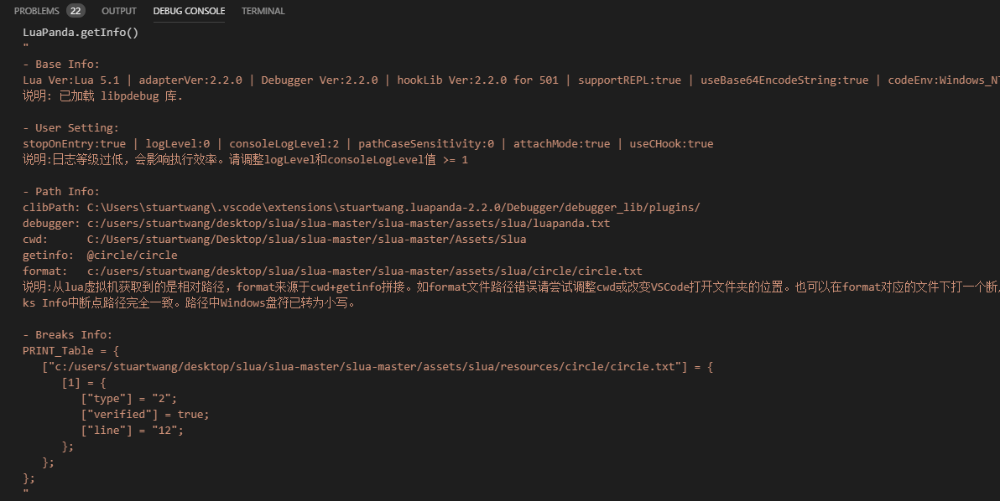

# 调试器接入指引

[TOC]


lua调试器依赖于 **luasocket** 和 **规范的路径**，需验证这两点后方可接入，下面详细介绍。

### 第一步 项目需带有luasocket

调试器需要 luasocket 使 debugger 和 VSCode 建立起通信。**目前lua框架: slua, slua-unreal, xlua 都已集成 luasocket**。

**测试方法**：在项目lua中加入`require("socket.core");`，如果运行不报错，工程已经包含luasocket，测试通过。


### 第二步 路径说明

**2.3.0增加了自动路径模式。开启后调试器会自动处理路径。用户只需保证VSCode打开的目录中不存在同名lua文件即可。当开启自动路径模式后，可跳过本节继续接入。**

launch.json文件中配置项 `"autoPathMode": true/false` 可以设置是否使用自动路径，无此配置项时默认关闭。

#### 关于自动路径配置和手动配置的说明：

调试器需要获得当前执行文件的绝对路径，以便做断点匹配和命中断点后打开对应文件。但是通过getinfo从lua虚拟机获取的路径可能是一个相对路径 ，调试器要把它转化为绝对路径。

把相对路径转为绝对路径的方式有以下两种:

1. 自动路径模式

自动路径处理，原理是VSCode端在启动时扫描当前工程中的lua文件，创建[文件路径表]。当需要绝对路径时，把从 getinfo 获得的非完整路径在[文件路径表]中查询 ，就可以获得绝对路径。这种路径策略易于配置使用，也有利于真机调试。因为[文件路径表]的查询key是文件名，所以需要用户保证工程中不存在同名lua文件，否则断点可能会指向错误。

2. 拼接路径模式

本模式下会使用 cwd+getinfo 和 VSCode 传来的断点路径作对比，完全一致才算命中。这种策略比较准确，不会受到同名文件的干扰，但是配置较麻烦。如果希望手动配置路径或了解处理的细节，请继续阅读。

调试器运行需要从lua虚拟机中获取当前文件信息。所以要求工程debug.getinfo或debug.traceback能输出较为规范的路径，就是**绝对路径**或者**对于固定位置的相对路径**。

**测试方法**：在代码中加入`print(debug.traceback("debug test"))`, 查看打印的堆栈。

如下打印出文件的绝对路径，可以进行下一步


打印出的信息是一个相对路径(路径前可能带有@)，这不会影响调试器工作，可进行下一步


打印出的路径包含在[string ]中，只要是符合上面的要求，是一个可以定位的路径，可进行下一步


如果仅输出了文件名，而这些文件其实不在同一个目录下，如下面的案例。此时需要调试器根据文件名定位文件路径，必须开启自动路径功能（ launch.json 中设置 autoPathMode:true ），否则无法正常工作。


**更新说明**:   lua中允许使用`require("a.b") `引用子目录中的文件，在标准lua库中，lua虚拟机会把路径转化为 a/b 传给调试器。但是有些开发框架没有做这样的转换，调试器会把收到的a.b当做一个文件处理。结果是导致调试进入require("a.b")的文件时，报找不到文件错误。

这个问题的解决办法需要用户修改自身框架，保证`require("a.b") `调用文件时传给lua虚拟机的路径是a/b。或者参见  [issue #24](https://github.com/Tencent/LuaPanda/issues/24) , 在调试器中强转换路径中的. 为 /


# 接入工作


### 第一步 下载VSCode调试扩展
切换到VSCode扩展标签，在商店中搜索`LuaPanda` 安装


### 第二步 放入debugger 文件，并引用

文件：`LuaPanda.lua`

下载位置：github 的 `Debugger` 目录下

把以上两个文件放在lua代码可以引用到的位置，并在用户代码中引用:

```
require("LuaPanda").start("127.0.0.1",8818);
```

*8818是默认端口号，如果需要修改，请同时修改launch.json的端口设置。


# 开始调试


### 第一步 使用VScode打开工程lua文件夹


### 第二步 调试配置
切换到VSCode的**调试选项卡**，点击齿轮，在弹出框中选择 LuaPanda (若无此选项说明以前用别的插件调试过lua , 要把先前用过的调试插件禁用)。会自动生成launch.json文件。


launch.json 配置项中要修改的主要是luaFileExtension, 改成lua文件使用的后缀就行。（比如xlua改为lua.txt, slua是txt）。**各配置项鼠标悬停会有提示**，可根据需要更改。


**注：调试时提示找不到文件的处理**

如果是自动路径模式，请检查lua后缀是否配置正确，以及VSCode打开的工程是否正确。

如果是手动路径模式，请按如下步骤：

如果开始调试时弹出了如下错误


不要停止调试，在VSCode中找到报错中提到的文件，在其中任意位置打一个断点，之后在调试控制台中输入`LuaPanda.doctor()`。这是一个帮助用户检查错误的命令，可以进行路径分析，给出建议。

输出结果


format是调试器拼接出的文件路径，filepath是文件真实存在的路径。

说明中会告诉用户format路径来源，用户需要对比format和filepath路径，调整launch.json中cwd或者修改VSCode打开文件夹位置，使format和filepath保持一致，即可修复问题。


### 第三步 开始调试

**先运行VSCode端，再运行Lua代码**: 点击调试选项卡左上角的绿色箭头，再运行unity/ue4工程。如果有stopOnEntry或是执行到断点处，就会自动停住。


enjoy! 


### 其他说明：关于 c hook库

LuaPanda 在PC上调试会默认使用 c hook，它是用c重写了debugger的核心hook部分，从而提高调试器的执行效率。 c hook会默认启用，无需单独接入。

验证方式：停在断点处后，在调试控制台输入`LuaPanda.getInfo()`， 返回信息的BaseInfo会给出提示，如果c库已加载，还会给出版本号。


+ 如果提示c库未能正确加载，可以使用`LuaPanda.doctor()`命令查看详细信息

+ c hook的源码放置在工程中`Debugger/debugger_lib`中。以供参考


# 调试器 API 介绍

调试器提供了一些API，可以在调试控制台直接调用，以查看当前环境和定位问题。

注意：调试控制台只能在运行到断点处才能执行命令

+ LuaPanda.getInfo()

  获取完整的调试器当前信息。

  Base Info : 系统基本信息

  User Setting: 用户设置项

  Path Info：路径相关和提示

  Breaks Info: 断点列表

  

+ LuaPanda.doctor()

  诊断工具，帮助用户诊断当前存在的问题。

  

+ LuaPanda.getBreaks()

  打印所有断点信息(已包含在getInfo中)

  


# 调试器设置项说明

调试器有几处设置项，这里做详细说明

### 1. VSCode端工程的launch.json文件

点击VSCode调试页卡的齿轮就会自动打开launch.json文件。

```lua
{
      "version": "0.2.0",
    "configurations": [
        {
            //正常调试配置
            "type": "lua",
            "request": "launch",
            "internalConsoleOptions": "openOnFirstSessionStart",
            "name": "LuaPanda",
            "program": "${workspaceFolder}",
            "cwd": "${workspaceFolder}",
            "pathCaseSensitivity": true, //路径大小写敏感
            "docPathReplace": [], //路径映射
            "luaFileExtension": "", //lua文件后缀
            "connectionPort": 8818, //连接端口号
            "stopOnEntry": true, //建立连接后自动停止
            "useCHook": true, //使用C调试库
            "logLevel": 1 //日志等级，默认无需修改
        },
        {
            //单文件调试配置
            "type": "lua",
            "request": "launch",
            "internalConsoleOptions": "neverOpen",
            "name": "LuaPanda-DebugFile", //单文件调试，请不要修改
            "program": "${workspaceFolder}",
            "cwd": "${workspaceFolder}",
            "pathCaseSensitivity": true,
            "luaPath": "", //lua.exe所在位置	
            "luaFileExtension": "",
            "connectionPort": 8818,
            "stopOnEntry": true,
            "useCHook": true,
            "logLevel": 1
        }
    ]
}
```

**cwd**：工作路径，${workspaceFolder}表示VSCode加载目录的路径。

**luaFileExtension**：lua文件后缀。不同框架中lua文件后缀可能不同, 比如

```
slua:txt
xlua:lua.txt
sluaunreal:lua
```

此项为空会尝试从getinfo中自动获取，如果获取不到会报打开文件错误，仍需用户手动填写。

**pathCaseSensitivity**：路径大小写敏感。如文件名是Test.lua ，执行此文件时getinfo获得的文件名是test.lua , 就需要把这个选项设置为false。否则路径因大小写不一致会查找不到文件。

**docPathReplace**：路径映射。当执行的lua文件和VScode查看的lua文件位置不同时, 可以使用路径映射，主要用于真机调试。如

`docPathReplace": ["A", "B"]`

我们把目录分为A:运行路径 和 B:观察路径
前提: 用户保证运行路径A 和观察路径B 的代码是完全相同的，否则调试时行号会错乱
具体实现:
调试器启动时会自动把 B 下的断点位置替换成 A, 以便运行时判断断点命中。
命中断点后，用户把堆栈中 A 路径替换回 B ，便于VSCode展示文件给用户看

**stopOnEntry**：调试器建立连接后立刻暂停，建议true。

**connectionPort**：连接端口号。此处请保持和`require("LuaPanda").start("127.0.0.1",8818);` 中一致，否则无法建立网络连接。

**logLevel**：日志等级，默认1。0是在输出所有日志，但输出日志会降低执行效率，造成运行卡顿，仅在定位问题时修改。

**useCHook**：是否使用C lib库，此项默认不显示，默认值为true。需要时可手动添加修改。true是自动尝试查找c库提升执行效率，false是不使用c库。


### 2. LuaPanda.lua 文件头部

```lua
local openAttachMode = true;            
local attachInterval = 1;               --attach间隔时间(s)
local customGetSocketInstance = nil;    --支持用户实现一个自定义调用luasocket的函数，函数返回值必须是一个socket实例。例: function() return require("socket.core").tcp() end;
local consoleLogLevel = 2;           --打印在控制台(print)的日志等级 0 : all/ 1: info/ 2: error.
local connectTimeoutSec = 0.005;       --等待连接超时时间, 单位s. 时间过长等待attach时会造成卡顿，时间过短可能无法连接。建议值0.005 - 0.05
```

**openAttachMode**: attach模式开启后可以在任意时刻启动vscode连接调试。缺点是不调试时也会略降低lua执行效率(会不断进行attach请求)。**所以请不要把调试器放在正式环境大量外发**。

**attachInterval**：attach请求间隔，默认1秒

**customGetSocketInstance**：调试器的运行依赖luasocket， 用户可以实现这个函数，以便调试器能够顺利引用到luasocket。

**consoleLogLevel** ： console日志等级，默认无需求改

**connectTimeoutSec**：连接超时时间，如出现调试器连接不上VSCode时，可以改长一些，但不建议超过0.05


# 调试器升级方法

通常VSCode插件版本是向下兼容的，只更新VSCode插件也可正常使用，但无法体验最新特性。

更新方法参阅文档 [update](https://github.com/Tencent/LuaPanda/blob/master/Docs/Manual/update.md)

