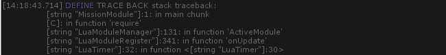
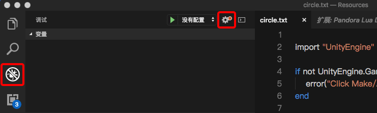
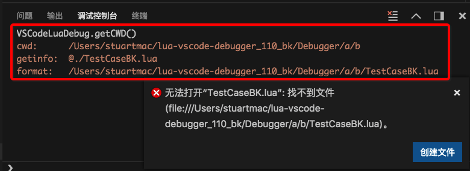
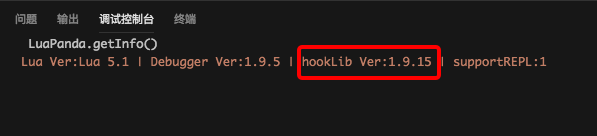

# 接入指引

[TOC]


lua调试器依赖于 **luasocket** 和 **规范的路径**，需验证这两点后方可接入，下面详细介绍。

### 第一步 项目需带有luasocket

调试器需要 luasocket 使 debugger 和 VSCode 建立起通信。**目前lua框架: slua, slua-unreal, xlua 都已集成 luasocket**。

**测试方法**：在项目lua中加入`require("socket.core");`，如果运行不报错，工程已经包含luasocket，测试通过。


### 第二步 路径规范

调试器运行需要从lua虚拟机中获取当前文件信息。所以要求工程debug.getinfo或debug.traceback能输出较为规范的路径，就是**绝对路径**或者**对于固定位置的相对路径**。目前的slua, xlua, slua-unreal框架都已经支持这个特性。但还是建议初期接入时做一下测试。

**测试方法**：在代码中加入`print(debug.traceback("debug test"))`, 查看打印的堆栈。

如下打印出文件的绝对路径，测试通过。


打印出的信息是一个相对路径(路径前可能带有@)，测试通过


打印出的路径包含在[string ]中，只要是符合上面的要求，是一个可以定位的路径，测试通过。


下面案例测试不通过，原因是仅输出了文件名，而这些文件其实不在同一个目录下。调试器无法仅根据文件名确定文件位置。



# 接入工作


### 第一步 下载VSCode调试扩展
切换到VSCode扩展标签，在商店中搜索`LuaPanda` 安装


### 第二步 放入debugger 文件，并引用

文件：`LuaPanda.lua`, `DebugTools.lua`

下载位置：本git项目的 `Debugger` 目录下

把以上两个文件放在lua代码可以引用到的位置，并在用户代码中引用。

```
require("LuaPanda").start("127.0.0.1",8818);
```

*8818是默认端口号，如果需要修改，请同时修改launch.json的设置。


# 开始调试


### 第一步 使用VScode打开工程lua文件夹


### 第二步 调试配置
切换到VSCode的**调试选项卡**，点击齿轮，在弹出框中选择 LuaPanda (若无此选项说明以前用别的插件调试过lua , 要把先前用过的调试插件禁用)。会自动生成launch.json文件。


launch.json 配置项中要修改的主要是luaFileExtension, 改成lua文件使用的后缀就行。（比如xlua改为lua.txt, slua是txt），如果保持为空则尝试自动获取。
各配置项鼠标悬停会有提示，可根据需要更改。


**注：调试时提示找不到文件的处理**

上面配置项中的`cwd`，其默认值`${workspaceFolder}`。${workspaceFolder}指的是VScode打开文件夹的路径。

如果开始调试时弹出了如下错误


不要停止调试，直接在调试控制台中输入`LuaPanda.getCWD()`



输出结果中

**cwd:** launch.json中用户设置的cwd路径

**getinfo:** getinfo从lua虚拟机获得的路径。我们希望这个路径应该能指示出lua文件所在位置，但通常会获得一个相对路径。

**format:** 被debugger用来查找文件的最终路径。

**format的拼接规则**：如果getinfo是绝对路径，会直接使用它作为format路径查找文件。如果getinfo是相对路径，format 是 **cwd + getinfo 拼接的绝对路径**。

+ 出现找不到文件提示，是 format 路径有误。看一下format路径是否多了或者缺少层级。如果是路径层级错了，调整cwd，可以增加路径层级或是/../保证拼接后的路径正确。

+ 如果是format的文件后缀有误，按上面的说明修改launch.json中的文件后缀。


### 第三步 开始调试

**先运行VSCode端，再运行Lua代码**: 点击调试选项卡左上角的绿色箭头，再运行unity/ue4工程。如果有stopOnEntry或是执行到断点处，就会自动停住。


enjoy! 


### 其他说明：关于 c hook库

LuaPanda 在PC上调试会默认使用 c hook，它是用c重写了debugger的核心hook部分，从而提高调试器的执行效率。 c hook会默认启用，无需单独接入。

验证方式：停在断点处后，在调试控制台输入`LuaPanda.getInfo()`返回信息包含hookLib Ver，说明c hook已经启动，如下




c hook的源码放置在工程中`Debugger/debugger_lib`中。以供参考


# 调试器设置项说明

调试器有几处设置项，这里做详细说明

### 1. VSCode端工程的launch.json文件

点击VSCode调试页卡的齿轮就会自动打开launch.json文件。

```lua
{
    "version": "0.2.0",
    "configurations": [
        {
            "type": "lua",
            "request": "launch",
            "name": "LuaPanda",
            "program": "${workspaceFolder}",
            "cwd": "${workspaceFolder}", //工作路径
            "TempFilePath": "${workspaceFolder}",//临时文件存放路径
            "luaFileExtension": "lua",//被调试文件后缀
            "pathCaseSensitivity": true,//路径是否大小写敏感
            "stopOnEntry": true,//是否在开始调试时停止
            "connectionPort": 8818,//连接端口号，默认8818
            "logLevel": 1 //日志等级
        	"useHighSpeedModule":true //是否使用C lib库
        }
    ]
}
```

**cwd**：工作路径，${workspaceFolder}表示VSCode加载目录的路径。

**luaFileExtension**：lua文件后缀。不同框架中lua文件后缀可能不同, 比如

```
slua:txt
xlua:lua.txt
sluaunreal:lua
```

此项为空会尝试从getinfo中自动获取，如果获取不到会报打开文件错误，仍需用户手动填写。

**pathCaseSensitivity**：路径大小写敏感。如文件名是Test.lua ，执行此文件时getinfo获得的文件名是test.lua , 就需要把这个选项设置为false。否则路径因大小写不一致会查找不到文件。

**stopOnEntry**：调试器建立连接后立刻暂停，建议true。

**connectionPort**：连接端口号。此处请保持和`require("LuaPanda").start("127.0.0.1",8818);` 中一致，否则无法建立网络连接。

**logLevel**：日志等级，默认1。0是在输出所有日志，但输出日志会降低执行效率，造成运行卡顿，仅在定位问题时修改。

**useHighSpeedModule**：是否使用C lib库，此项默认不显示，默认值为true。需要时可手动添加修改。true是自动尝试查找c库提升执行效率，false是不使用c库。


### 2. LuaPanda.lua 文件头部

```lua
local openAttachMode = true;            --是否开启attach模式。
local attachInterval = 1;               --attach间隔时间(s)
local TCPSplitChar = "|*|";             --json协议分隔符
```

**openAttachMode**: attach模式开启后可以在任意时刻启动vscode连接调试。缺点是不调试时也会略降低lua执行效率(会不断进行attach请求)。**所以请不要把调试器放在正式环境大量外发**。

**attachInterval**：attach请求间隔，默认1秒

**TCPSplitChar**：网络请求的隔断符。因为TCP可能出现粘包，消息传输需要隔断符号，默认请不要修改。


# 调试器更新方法

调试器会不断完善和扩充功能。当发布新版本后，VSCode 会推通知给用户。更新步骤：

1. VSCode中更新插件
2. 从git仓库中获取最新的 LuaPanda.lua, DebugTools.lua 文件，覆盖原文件即可

通常VSCode插件版本是向下兼容的，只更新VSCode插件也可正常使用，但无法体验最新特性。