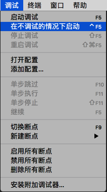
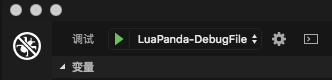

# 独立文件调试说明(debugging independent files)

[TOC]

### 什么是独立文件

我们这里的 **独立文件** 指的是不依赖于 `其他模块/特定运行环境/特定框架` 的 lua 文件。

即存在一个文件 a.lua 用户执行

```
lua a.lua
```

就可以正确运行，并输出运行结果的文件。调试器执行独立文件也正是调用了上面的命令，这些被执行的命令可以从vscode的终端里看到。

如果希望使用运行独立文件，第一步是建立 launch.json ，可以[参阅文档](launch-json-introduction.md)，这里不再重复。


### 快速运行独立文件

把代码编辑窗口切换到待执行文件（让待执行文件的窗口处于激活状态），然后如下图操作。



VSCode 会启动一个新终端，调用 lua 命令来执行当前打开的lua代码。


### 调试独立文件

把调试选项切换至`LuaPanda-DebugIndependentFile`,  **代码编辑窗口切换到待调试文件**，点击下图绿色箭头或按F5运行。



注意：此模式下无需加入require("LuaPanda"), 调试器会自动引用。


-----------------------

如果在阅读本文档时有困惑，欢迎在issue中留言，以便我们了解没有讲清楚的地方