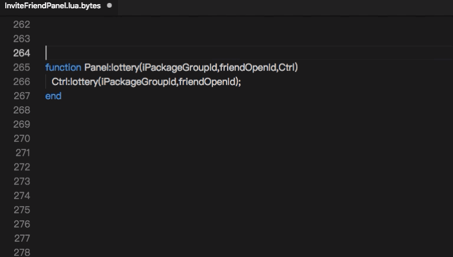
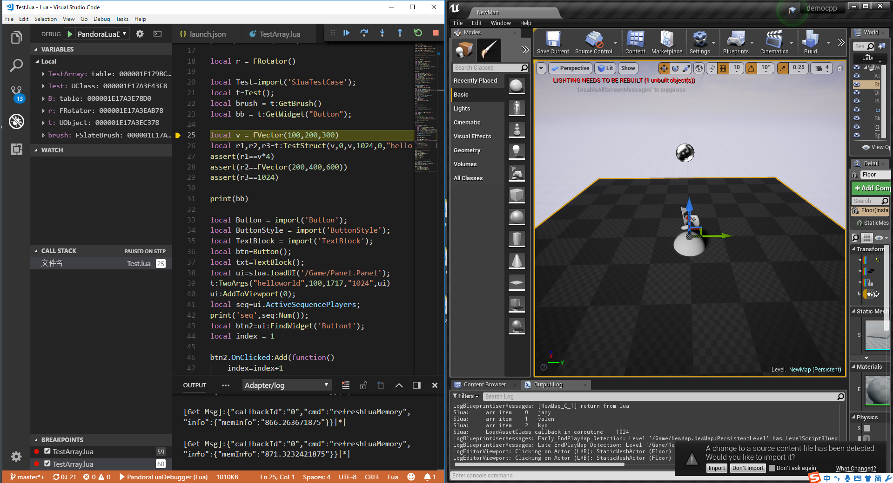
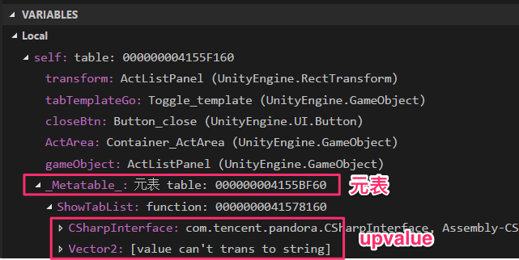
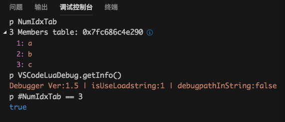
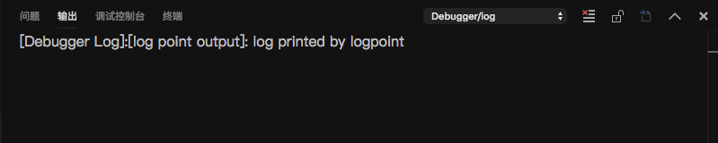

# 项目介绍

[TOC]

### lua 代码辅助

经常使用VSCode做lua开发，所以花时间开发了lua代码辅助功能。

目前实现的主要功能：

- 自动补全（auto completion）
- 代码片段（snippet completion）
- 定义跳转（definition）
- 引用分析  (find reference)
- 类型推断  (type inference)
- 生成注释  (comment generation)
- 代码诊断（linting）：依赖 [luacheck](https://github.com/mpeterv/luacheck)
- 代码格式化  (formatting)  :  依赖 [lua-fmt](https://github.com/trixnz/lua-fmt)

​    功能展示: 代码提示和定义跳转

​    功能展示: 生成注释	

​    	

使用代码提示时注意两点，无需其他配置

1. 使用 VScode 打开的包含lua文件的文件夹，而不是单个lua文件。

2. VScode 文件后缀和类型关联正确，如果 lua 文件后缀是 txt 或者是 lua.txt 都要正确关联lua类型，插件才能生效。

   

### lua 代码调试

调试器总体分为两部分，分别是[VSCode 插件]和 运行于lua进程的[调试器主体]。二者建立网络连接通过 tcp 通信，支持真机/远程调试，所以需要用户项目中包含 luasocket。

调试器总体架构可以参考下图。左侧的 VSCode 是 IDE ，中间的 Debug Adapter 表示调试器的 VSCode 插件，它和IDE通信遵循DAP协议。最右侧的 debugger 是调试器运行在 lua 中的部分，也就是 luapanda.lua文件，它捕获lua 运行状态，在触发命中断点等事件时，通知 Debug Adapter。

*图片来源 https://code.visualstudio.com/api/extension-guides/debugger-extension*

和其他调试器不同的是 : LuaPanda 的 debugger 部分使用了 lua + C 双架构。主体使用 lua 开发（可独立运行），另外有一个高性能的C扩展库，兼顾了C的高效以及lua的灵活性。C 扩展库会根据场景自动尝试加载，即使加载不了也不会影响调试，用户可以不关注。

lua 调试器适用的场景

- 动态下发，避免游戏打包后无法调试的。适合发布后使用。

C 模块适合的场景

- 效率高，适合开发期调试。

调试器的 IDE 使用VSCode，下面是调试界面。

# 特性

- 支持单步调试，断点调试，条件断点，协程调试
- 支持lua5.1 - 5.3,  win/mac 平台，支持 slua/xlua/slua-unreal 等框架
- 支持REPL :  在断点处可以监视和运行表达式，并返回执行结果
- 可以根据断点密集程度自动调整 hook 频率，有较好的效率
- 支持 attach 模式，lua 运行过程中可随时建立连接
- 使用 lua / C 双调试引擎。lua 部分可动态下发，避免打包后无法调试。C 部分效率高，适合开发期调试。
- 支持多目标调试(multi target) ，可以同时调试多个 lua 进程。
- 支持真机/远程调试，用户可以选择 VScode 和 lua 进程作为  C/S 端。

### 多平台的支持

Mac  console + lua 5.1

Win  slua-unreal + lua5.3

### 展示元表 和 upvalue

可以显示table的成员数目和元表，function的upvalue。

### 表达式监控 和 调试控制台

在变量监控区可以输入并监控表达式

调试控制台，可以在断点处输入表达式，执行函数，或者输入变量名观察它的值

### 支持attach模式

通常的调试流程是先运行vscode端，再开始执行lua工程。
attach模式支持先执行lua工程，在希望调试的时候运行调试器，建立连接，开始调试。

### 条件断点和记录点

在 VSCode 行号前点击鼠标右键可选择普通断点，条件断点和记录点。

若用户输入的条件是 `a == 2` , 调试器会执行表达式，并获取执行结果。注意执行结果 nil 和 false 为假，其他都为真。

记录点在被执行时会打印日志。日志输出在：`DebugConsole - OUTPUT - Debugger/log` 

### 变量赋值

断点处允许用户修改变量的值， 用户也可以通过调试控制台给变量赋值。

### 单文件调试

使用单文件调试，可以在工程中很方便的调试单个lua文件。

详细配置请查看 [单文件调试说明](https://github.com/Tencent/LuaPanda/blob/master/Docs/Manual/debug-file.md)

