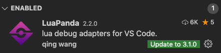
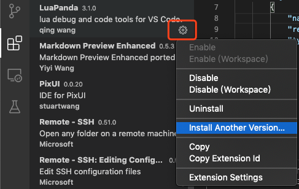

# 升级和版本说明

### 自动升级

**VSCode 插件升级** ：当出现如下升级提示时，点击 update 即可把插件升级到最新版本。

**LuaPanda 文件升级**：当在 vscode 中启动调试器时，会检测当前打开项目中的 Luapanda.lua 版本，并自动弹出以下提示。如果用户自己修改过 Luapanda.lua 文件，请做好备份，以免文件被覆盖。

**重建 launch.json**: 升级后如果调试出现问题，建议重建 launch.json 文件。具体方法是删除 工程下 .vsode/launch.json ，再按如下步骤重建。

### 手动升级

调试器框架分为三部分

+ VSCode 扩展。 下载地址 : https://marketplace.visualstudio.com/items?itemName=stuartwang.luapanda

  如有更新，VSCode 会主动提示。

+ lua文件。 下载地址：https://github.com/Tencent/LuaPanda/releases 

  `Debugger/LuaPanda.lua`

  如果 VScode 插件检测到项目中 LuaPanda.lua 文件比较旧，会弹出升级提示。如果用户对 LuaPanda.lua 文件内容做过修改，请先备份在升级，避免升级后出现异常影响使用。

  也可以自己到 github上手动下载最新的 LuaPanda.lua，替换工程中原有文件。

+ 调试器c库 ： plibdebug

  plibdebug 默认放置在 VSCode 扩展中，无需用户手动更新。
  
  它作为一个加速插件，不会对调试器功能产生影响。仅是把耗时部分放在c中执行，提高执行效率。
  
  如果使用源码编译的方式，需要更新代码重新编译。源码位置 `Debugger/debugger_lib`

综上，通常用户只需要关注 LuaPanda.lua 文件，保持最新即可。

### 使用旧版本

如果升级到新版本遇到了文件，希望继续使用旧版本调试器。可以按以下操作

+ 下载指定版本的 VScode 扩展

​		进入商店找到 LuaPanda 点击旁边的齿轮，选择 install another version ，选择需要的版本号就行。

+ 下载对应的lua文件

  tag 保存位置 https://github.com/Tencent/LuaPanda/releases

  下载对应版本的包，并把其中的 `Debugger/LuaPanda.lua` 放置在项目中